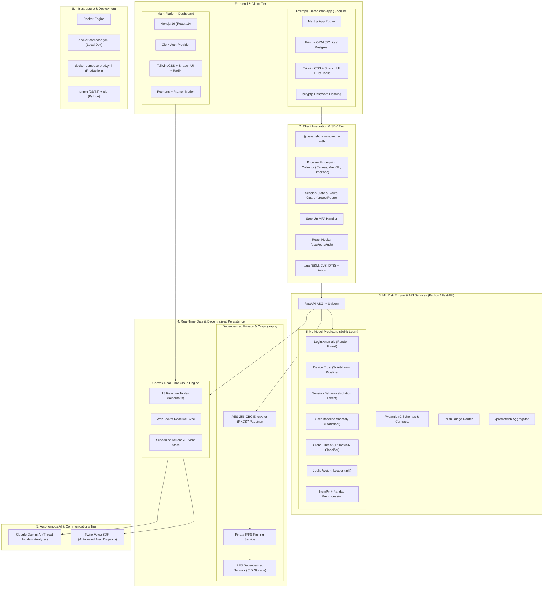
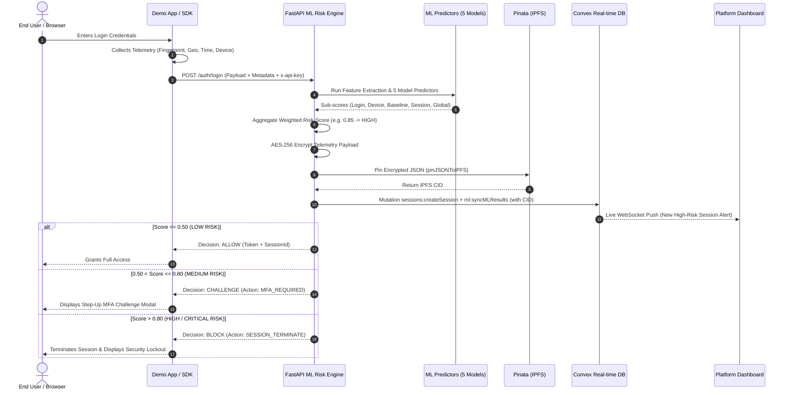

# AegisAuth — Complete Codebase Index, Architecture & System Workflow Guide

> **Repository**: `raisoni-amravati-hackathon/raisoni-amravati-hackathon`  
> **Platform**: **AegisAuth** — Adaptive Threat Intelligence & ML-Powered Zero-Trust Security  
> **Target Event**: Raisoni Amravati Hackathon  

---

## 1. Executive Summary & Project Overview

### What is AegisAuth?
**AegisAuth** is a distributed, machine-learning-driven **Adaptive Authentication and Continuous Threat Intelligence platform**. It enables web applications to dynamically evaluate authentication and in-session risk in real time, shifting security paradigms from static perimeter defense to proactive, zero-trust behavioral verification.

Rather than relying purely on static credentials (username/password), AegisAuth evaluates **multi-dimensional telemetry signals** (device fingerprints, geo-velocity, login frequency, IP reputation, ASN shifts, behavioral patterns) using an ensemble of 5 machine learning models. Based on calculated risk scores ($0.0 - 1.0$), the system autonomously dispenses adaptive policy decisions: **ALLOW**, **CHALLENGE (MFA)**, **RESTRICT**, or **BLOCK (Session Termination)**.

### Core Value Propositions
1. **Multi-Model ML Risk Engine**: Combines specialized machine learning models (Login Anomaly, Device Trust, Session Behavior, Baseline Anomaly, Global Threat) into a unified risk score.
2. **Plug-and-Play Developer SDK (`@devanshthaware/aegis-auth`)**: Zero-friction client library for signal collection, route protection, MFA triggers, and session lifecycle monitoring.
3. **Real-Time Reactive Security Dashboard**: Powered by Next.js 16, Shadcn UI, and Convex, providing live telemetry streams, attack logs, application API key management, and policy threshold configurations.
4. **Decentralized Cryptographic Privacy (AES-256 + IPFS)**: PII and sensitive device telemetry are encrypted via AES-256-CBC and pinned to IPFS via Pinata, storing only immutable IPFS Content Identifiers (CIDs) on the central database.
5. **AI-Assisted Security Dispatch & Voice Support**: Integrates Google Gemini generative AI and Twilio for automated security incident reporting and phone notifications.

---

## 2. High-Level System Architecture

```mermaid
flowchart TD
    subgraph ClientLayer ["Client & Integration Tier"]
        DemoApp["Demo Web App (Socially)"]
        ExternalApp["Third-Party Web Application"]
        SDK["@devanshthaware/aegis-auth SDK"]
    end

    subgraph BackendAPI ["FastAPI ML Risk Engine (Port 8000)"]
        RouterAuth["/auth/login, /auth/signup"]
        RouterRisk["/predict/risk (Unified Orchestrator)"]
        SubPredictors["Sub-Predictors (Login, Device, Session, Global, Baseline)"]
        Aggregator["Risk Aggregator & Decision Matrix"]
        EncryptionModule["AES-256 Encryptor"]
        PinataService["Pinata IPFS Pinning Service"]
    end

    subgraph StorageLayer ["Persistence & External Services"]
        Convex["Convex Realtime Backend"]
        IPFS["IPFS Decentralized Storage (Pinata)"]
        GeminiTwilio["Gemini AI & Twilio Voice"]
    end

    subgraph ManagementTier ["Platform Admin & Developer Dashboard (Port 3000)"]
        DashboardUI["Next.js 16 Dashboard"]
        PolicyManager["Risk Policy & Threshold Config"]
        LiveMonitor["Live Session & Event Stream"]
    end

    DemoApp -->|1. Auth & Telemetry| SDK
    ExternalApp -->|1. Auth & Telemetry| SDK
    SDK -->|2. HTTP POST (x-api-key)| RouterRisk
    SDK -->|2. HTTP POST (Auth Bridge)| RouterAuth

    RouterAuth --> SubPredictors
    RouterRisk --> SubPredictors
    SubPredictors --> Aggregator
    Aggregator -->|Risk Score + Decision| SDK

    RouterAuth -->|Encrypt Telemetry| EncryptionModule
    EncryptionModule -->|Pin Ciphertext| PinataService
    PinataService -->|IPFS CID| IPFS

    RouterRisk -->|Sync State & ML Scores| Convex
    RouterAuth -->|Sync Sessions & Events| Convex

    DashboardUI -->|Realtime Subscription| Convex
    PolicyManager -->|Update Policies| Convex
    Convex -->|Trigger AI Support Action| GeminiTwilio
```

---

## 2.1. Full Tech Stack Diagram & Component Layer Map



### Tech Stack Summary Matrix

| Layer / Category | Technologies & Libraries Used |
| :--- | :--- |
| **Frontend Frameworks** | Next.js 16 (App Router), React 19, TypeScript |
| **Styling & Design System** | TailwindCSS, Shadcn UI, Radix UI Primitives, Lucide Icons |
| **Data Visualization & Motion** | Recharts, Framer Motion |
| **Platform Authentication** | Clerk (`@clerk/nextjs`) |
| **Client / Integration SDK** | TypeScript, `tsup` bundler, Axios, Custom React Hooks |
| **Demo App Persistence** | Prisma ORM, SQLite / PostgreSQL, `bcryptjs` |
| **Backend & API Engine** | Python 3.11+, FastAPI, Uvicorn ASGI, Pydantic v2 |
| **Machine Learning & Analytics** | Scikit-Learn (RandomForest, IsolationForest, LogisticRegression), Joblib, Pandas, NumPy |
| **Real-time Database** | Convex (Serverless Reactive Database & Scheduled Actions) |
| **Decentralized Storage & Crypto** | AES-256-CBC (`cryptography.hazmat`), Pinata Cloud IPFS API, IPFS CIDs |
| **GenAI & Incident Dispatch** | Google Gemini Generative AI, Twilio Voice Call API |
| **Containerization & Tooling** | Docker, Docker Compose, `pnpm`, `pip`, `git` |

---

## 3. Comprehensive Codebase Index

The project is organized as a multi-tier monorepo with 4 principal applications/packages:

```
raisoni-amravati-hackathon/
├── main-platform-frontend/      # Next.js 16 Developer Dashboard & Platform Portal
├── ml-backend/                  # FastAPI Python ML Risk Engine & IPFS Bridge
├── sdk/                         # TypeScript/JavaScript Client & Server SDK
├── example-demo-app/            # Sample Next.js Social Media Web App ("Socially")
├── docker-compose.yml           # Local dev orchestrator for all services
├── docker-compose.prod.yml      # Production container configuration
└── [Architecture Documents]     # Markdown specifications and design models
```

### 3.1. `ml-backend/` (FastAPI Risk Engine)
- **`main.py`**: Uvicorn server entrypoint, CORS configuration, route inclusion.
- **`src/api/`**:
  - `routes_risk.py`: Unified risk evaluation endpoint (`POST /predict/risk`), maps flat SDK payloads to multi-model schemas, aggregates scores.
  - `routes_auth.py`: Direct auth bridge (`POST /auth/signup`, `POST /auth/login`), calculates risk, creates Convex sessions, syncs ML factors.
  - `routes_login.py`, `routes_device.py`, `routes_session.py`, `routes_global.py`, `routes_baseline.py`: Individual sub-model inference routes.
  - `routes_support.py`: Twilio voice call dispatcher and Google Gemini incident reporting assistant.
  - `schemas.py`: Pydantic input/output contracts for models, unified payloads, and SDK compatibility.
- **`src/inference/`**:
  - `model_loader.py`: Singleton model loader caching Joblib `.pkl` weights from `/weights/`.
  - `login_predictor.py`, `device_predictor.py`, `session_predictor.py`, `global_predictor.py`, `baseline_predictor.py`: Feature transformation and inference runners.
  - `risk_aggregator.py`: Weighted risk matrix aggregating sub-model outputs into unified risk score ($0.0 - 1.0$) and categorization (`LOW`, `MEDIUM`, `HIGH`, `CRITICAL`).
- **`src/training/`**:
  - `train_login.py`, `train_device.py`, `train_session.py`, `train_global.py`, `train_baseline.py`: Synthetic dataset generators and Scikit-Learn training pipelines (RandomForest, IsolationForest, LogisticRegression).
- **`src/utils/`**:
  - `encryption.py`: AES-256-CBC encryption/decryption with PKCS7 padding for metadata.
  - `pinata.py`: Pinata IPFS pinning client for decentralized ciphertext storage.
  - `convex.py`: HTTP mutation/query client bridging ML backend with Convex.
  - `logger.py`: Structured console logging.
- **`weights/`**:
  - Pre-trained `.pkl` model artifacts loaded at runtime.

---

### 3.2. `main-platform-frontend/` (Next.js 16 + Convex Dashboard)
- **`app/`** (App Router):
  - `dashboard/page.tsx`: Main overview with active applications, security health metrics, and threat graphs.
  - `dashboard/applications/`: Create and manage client applications, generate API keys and client secrets.
  - `dashboard/monitoring/`: Real-time session explorer, live traffic feed, and IPFS metadata inspector.
  - `dashboard/security/`: Risk policy configuration, anomaly thresholds, auto-block and MFA rules.
  - `dashboard/access/`: Granular role-based access control (RBAC) and team settings.
  - `dashboard/support/`: Support ticketing center with AI assistance.
  - `sign-in/`, `sign-up/`: Clerk-powered user identity.
- **`convex/`** (Convex Real-time Backend):
  - `schema.ts`: Primary database schema defining 13 tables (`applications`, `sessions`, `activities`, `events`, `mlScores`, `riskPolicies`, `organizations`, `alerts`, `securitySettings`, `supportTickets`, `supportMessages`, `users`, `loginHistory`).
  - `applications.ts`: Application registration, API key lookup, security secret rotation.
  - `sessions.ts`: Session lifecycle management, activity logging, threat metrics aggregation.
  - `events.ts`: Immutable state-transition event store (`SIGNAL_RECEIVED`, `RISK_CALCULATED`, `DECISION_MADE`, etc.).
  - `ml.ts`: Convex action invoking `ml-backend` and mutation syncing scores and factor breakdowns.
  - `sessionState.ts`: State machine transitions (`NEW` $\rightarrow$ `ACTIVE` $\rightarrow$ `CHALLENGED` $\rightarrow$ `BLOCKED`).
  - `securitySettings.ts`: Application-specific security toggles (IP allowlist, enforce MFA).
  - `riskPolicies.ts`: Policy rules, threshold overrides, and seeding defaults.
  - `admin.ts`: Platform-wide administrative queries and metrics.

---

### 3.3. `sdk/` (`@devanshthaware/aegis-auth` TypeScript Library)
- **`src/core/config.ts`**: SDK initialization (`initAegisAuth`) storing `appId`, `apiKey`, `endpoint`, and polling intervals.
- **`src/signals/signals.ts`**: Browser telemetry signal collection (screen resolution, timezone, WebGL/canvas fingerprinting, platform, navigator traits).
- **`src/auth/auth.ts`**: Client/server authentication wrappers (`login`, `signup`, `logout`, `getCurrentUser`).
- **`src/decision/decision.ts`**: Decision handler mapping server decisions (`ALLOW`, `CHALLENGE`, `RESTRICT`, `BLOCK`) to client actions.
- **`src/mfa/mfa.ts`**: Step-up MFA verification routines (TOTP/challenge flow).
- **`src/session/session.ts`**: Session state tracking, route guard middleware (`protectRoute`), and session change listeners.
- **`src/hooks/useAegisAuth.ts`**: React hook exposing authentication state, real-time risk score, and challenge handlers.
- **`src/actions/actions.ts`**: Action executor for automated UI enforcement (e.g. redirecting to lockdown, showing MFA modals).

---

### 3.4. `example-demo-app/` (Next.js Social App Demo: "Socially")
- **`src/actions/user.action.ts`**: Demonstrates full integration of `@devanshthaware/aegis-auth` during user registration, password verification, cookie session tracking, and security alert dispatch.
- **`src/lib/aegis.ts`**: Server-side SDK configuration.
- **`src/app/simulations/`**: Interactive security attack simulator allowing users to trigger Brute Force, Impossible Travel, and Malicious IP attacks to observe AegisAuth's real-time mitigation in action.
- **`prisma/schema.prisma`**: Local SQLite/PostgreSQL store for the demo app's social data (users, posts, comments, notifications, login history, security alerts).

---

## 4. End-to-End Workflow & Lifecycle



---

## 5. Machine Learning Risk Assessment Engine

The ML backend (`ml-backend`) evaluates incoming sessions across 5 core risk vectors:

| Model | Technique | Key Features Analyzed | Risk Focus |
| :--- | :--- | :--- | :--- |
| **Login Anomaly** | Random Forest Classifier | `login_hour`, `device_known`, `country_changed`, `login_velocity`, `ip_reputation_score`, `failed_attempts`, `mfa_failures` | Credential stuffing, brute force, strange hour logins |
| **Device Trust** | Scikit-Learn Pipeline | `device_age_days`, `browser_changed`, `os_changed`, `screen_res_changed`, `hardware_concurrency` | Device spoofing, emulator usage, identity hijacking |
| **Session Behavior** | Isolation Forest / Anomaly | `request_rate`, `endpoint_entropy`, `typing_speed_variance`, `click_jitter`, `session_duration` | Bot automated scraping, unnatural navigation patterns |
| **Baseline Anomaly** | Statistical Anomaly Model | User-specific historical mean deviation, login frequency delta | Deviation from individual user habits |
| **Global Threat** | Global Threat Classifier | `tor_node`, `vpn_proxy_flag`, `threat_asn_score`, `global_ip_reputation` | Known botnets, malicious proxies, high-threat ASNs |

### Weighted Aggregation Formula
The unified risk score $R_{total} \in [0.0, 1.0]$ is computed as:
$$R_{total} = w_1 R_{login} + w_2 R_{device} + w_3 R_{session} + w_4 R_{baseline} + w_5 R_{global}$$
- Critical threat overrides: If severe indicators are detected (e.g. `failed_attempts > 5` or `country_velocity > 1000 km/h`), the engine applies exponential penalty multipliers.

---

## 6. Cryptographic Privacy & Decentralized IPFS Storage

AegisAuth solves telemetry privacy concerns by guaranteeing **Zero Raw PII Persistence**:
1. **AES-256-CBC Encryption**: Telemetry payloads (device specs, location coordinates, user identifiers) are encrypted at the ML backend using `cryptography.hazmat` with PKCS7 padding and a 32-byte master key.
2. **IPFS Pinning via Pinata**: The base64-encoded encrypted payload is pinned to IPFS (`https://api.pinata.cloud/pinning/pinJSONToIPFS`).
3. **CID-Only Storage**: Convex stores only the resulting IPFS `pinataCid` on the `sessions` table.
4. **Auditability**: Security officers with the master key can inspect and decrypt historical telemetry audits directly through the platform dashboard.

---

## 7. Development & Deployment Guide

### Running via Docker Compose (Recommended)
The repository contains full multi-container configurations for orchestrating the entire suite:

```bash
# 1. Clone repository and navigate to root
cd raisoni-amravati-hackathon

# 2. Build and launch all services
docker-compose up --build
```

### Service Map:
- **Platform Frontend Dashboard**: [http://localhost:3000](http://localhost:3000)
- **Demo Social Application**: [http://localhost:3001](http://localhost:3001)
- **FastAPI ML Backend & Docs**: [http://localhost:8000/docs](http://localhost:8000/docs)

### Environment Configuration:
- `ml-backend/.env`: `CONVEX_URL`, `PINATA_JWT`, `MASTER_ENCRYPTION_KEY`, `GEMINI_API_KEY`, `TWILIO_ACCOUNT_SID`, `TWILIO_AUTH_TOKEN`.
- `main-platform-frontend/.env.local`: `NEXT_PUBLIC_CONVEX_URL`, `NEXT_PUBLIC_CLERK_PUBLISHABLE_KEY`, `CLERK_SECRET_KEY`, `NEXT_PUBLIC_ML_BACKEND_URL`.
- `example-demo-app/.env.local`: `NEXT_PUBLIC_AEGIS_APP_ID`, `NEXT_PUBLIC_AEGIS_API_KEY`, `NEXT_PUBLIC_AEGIS_ENDPOINT`.

---

## 8. Summary Checklist of Capabilities

- [x] **5-Model ML Risk Prediction Engine** with real-time inference.
- [x] **Dynamic Multi-State Enforcement** (`ALLOW`, `CHALLENGE`, `RESTRICT`, `BLOCK`).
- [x] **Decentralized Telemetry Storage** (AES-256 encrypted + Pinata IPFS).
- [x] **TypeScript Client/Server SDK** (`@devanshthaware/aegis-auth`).
- [x] **Reactive Security Operations Dashboard** (Next.js 16 + Convex).
- [x] **Real-World Sample Demo Application** ("Socially" social app).
- [x] **Attack Simulation Sandbox** (Brute Force, Geo-Velocity, IP Spoofing).
- [x] **AI-Driven Support & Voice Incident Dispatch** (Gemini + Twilio).
