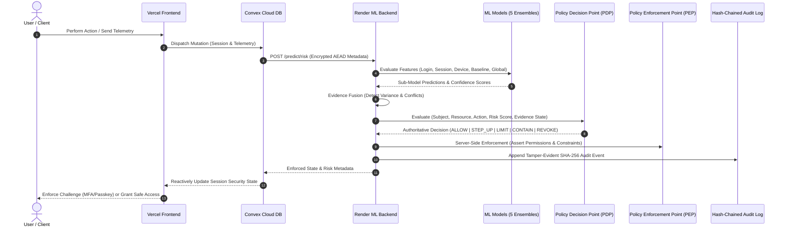
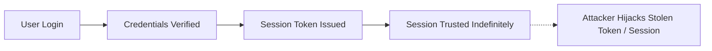
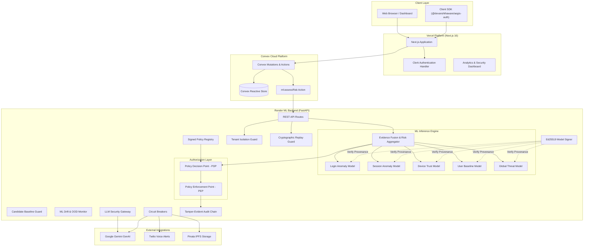
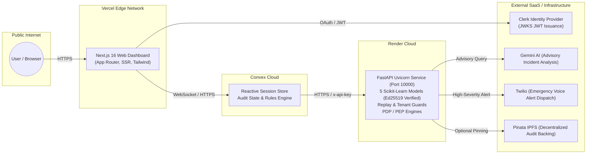
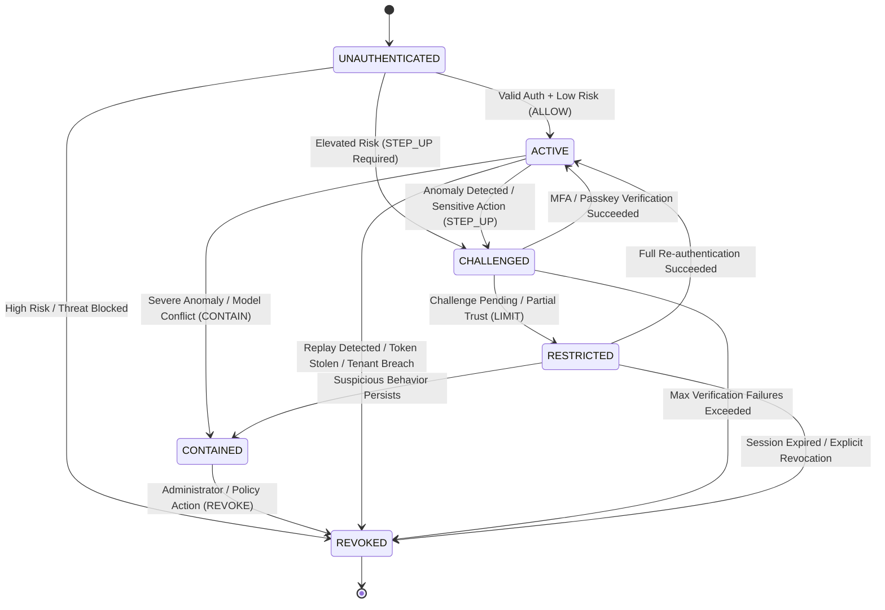
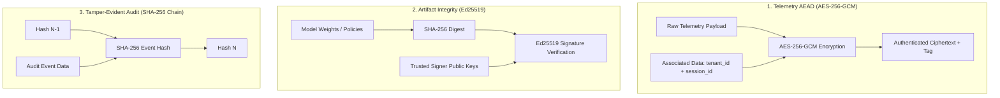
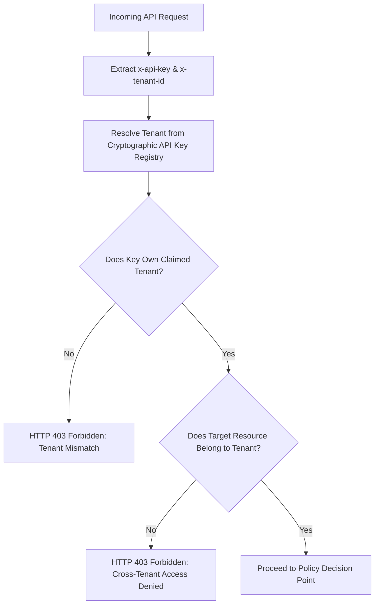
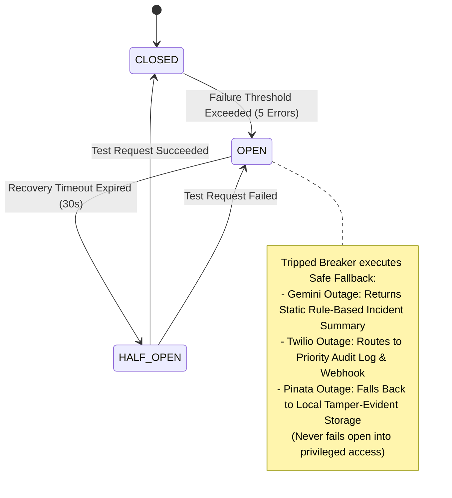
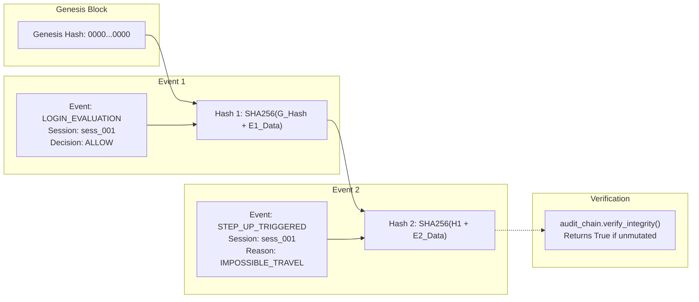

# 🛡️ AegisAuth Pro

**Adaptive, risk-aware continuous authentication with deterministic policy enforcement.**

AegisAuth Pro is a zero-trust, continuous authentication and threat intelligence platform designed to replace static login sessions with dynamic, evidence-based security evaluation. By combining multi-model behavioral machine learning, cryptographic replay protection, Ed25519 artifact verification, server-side Policy Enforcement (PEP/PDP), and tamper-evident audit logging, AegisAuth ensures that sessions adapt in real-time to evolving threat landscapes without delegating authoritative access decisions to probabilistic models.

---

## 🚀 Live Deployment

AegisAuth Pro is fully deployed across a distributed, multi-tier cloud infrastructure:

| Component | Service Layer | Platform | Deployment Status | Endpoint / Reference |
| :--- | :--- | :--- | :--- | :--- |
| **Frontend Dashboard** | Web UI & Platform Admin | **Vercel** | Live / Production | `https://aegis-auth-adaptive-authentication.vercel.app/` *(Deployed via Next.js 16)* |
| **ML Backend** | Risk Engine & Security Core | **Render** | Live / Production | `https://aegis-auth-adaptive-authentication.onrender.com` |
| **Data & State Store** | Session & Policy Reactive DB | **Convex Cloud** | Live / Production | `https://mild-greyhound-316.convex.cloud` |
| **Client SDK** | Integration Library | **npm / local** | Built (`v1.0.0`) | `@devanshthaware/aegis-auth` (`dist/` ESM/CJS/D.TS) |

### Production Request & Enforcement Flow



---

## 🎯 Problem Statement

Traditional web and cloud security relies on **point-in-time authentication**:



Once an initial authentication event succeeds, the resulting session is typically trusted unconditionally until expiration. This model fails against modern attack vectors:

- **Session Hijacking & Token Theft**: An attacker possessing a valid cookie or bearer token bypasses perimeter defenses.
- **Credential Stuffing & Botnets**: Low-and-slow automated attacks circumvent simple rate limiters.
- **Impossible Travel & Geo-Velocity Anomalies**: Legitimate credentials used concurrently from disparate geographical regions.
- **Device & Environment Spoofing**: Adversaries manipulating User-Agent headers and client-side device properties.
- **Privilege Escalation during Active Sessions**: Legitimate sessions co-opted to perform sensitive administrative actions.

---

## 💡 Solution

AegisAuth Pro introduces **continuous, adaptive risk evaluation**:

```mermaid
flowchart TD
    ID[1. Identity & Credentials] --> SESS[2. Monotonic Active Session]
    SESS --> EVID[3. Telemetry & Cryptographic Evidence]
    EVID --> ML[4. Multi-Signal Risk Intelligence]
    ML --> PDP[5. Policy Decision Point]
    PDP --> PEP[6. Server-Side Policy Enforcement]
    PEP --> RESP[7. Dynamic Response: ALLOW | STEP_UP | CONTAIN | REVOKE]
```

Authentication is treated as a continuous state rather than a one-time gate. As client behavioral signals and network telemetry shift, the platform dynamically adjusts security requirements—triggering step-up MFA, restricting high-privilege operations, or immediately revoking compromised sessions.

---

## 🧠 Core Principle

> ### ⚠️ Intelligence ≠ Authority
>
> **Machine learning models provide probabilistic risk intelligence; they MUST NEVER hold authoritative authorization power.**
>
> In AegisAuth Pro:
> - ML models compute risk scores, confidence intervals, and anomaly classifications.
> - Probabilistic predictions are treated purely as **advisory inputs**.
> - The **Policy Decision Point (PDP)** combines subject roles, tenant context, resource sensitivity, session state, assurance levels, and ML risk scores into a deterministic decision.
> - The **Policy Enforcement Point (PEP)** authoritatively applies the decision server-side.

---

## 🏗️ System Architecture



---

## ☁️ Production Deployment Architecture



---

## 🔐 Security Architecture

| Security Domain | Core Function | Implementation File | Threat Addressed |
| :--- | :--- | :--- | :--- |
| **Authentication** | Multi-factor & passkey verification with Clerk JWT validation | `main-platform-frontend/middleware.ts`, `sdk/src/webauthn/` | Credential theft, unauthorized session initiation |
| **Authorization (PDP/PEP)** | Server-side RBAC/ABAC policy decision and enforcement point | `ml-backend/src/security/authorization.py` | Privilege escalation, client-side security bypass |
| **Tenant Isolation** | Strict server-side verification of API keys and tenant context | `ml-backend/src/security/tenant_guard.py` | Multi-tenant data leakage, cross-tenant IDOR attacks |
| **Session Security** | Monotonic session transitions, version checking, and containment | `ml-backend/src/api/routes_auth.py`, `convex/sessions.ts` | Session hijacking, race conditions, stale policy application |
| **Replay Protection** | Atomic sliding-window validation of nonces, sequence numbers, and payload hashes | `ml-backend/src/security/replay_guard.py` | Telemetry replaying, man-in-the-middle request duplication |
| **AEAD Cryptography** | AES-256-GCM authenticated encryption with Associated Data (AAD) binding | `ml-backend/src/utils/encryption.py` | In-transit telemetry tampering, eavesdropping |
| **Model Integrity** | Ed25519 cryptographic signature verification of all `.pkl` model weights before loading | `ml-backend/src/security/model_signer.py` | Model backdoor injection, weight tampering, supply chain attacks |
| **Policy Integrity** | Dual-custody signed policy lifecycle (Draft $\to$ Review $\to$ Active) | `ml-backend/src/security/policy_registry.py` | Unauthorized policy modification, rogue administrator tampering |
| **Baseline Poisoning Defense** | Staged candidate validation window and burst anomaly filtering | `ml-backend/src/security/baseline_guard.py` | Slow-drift baseline poisoning, adversarial profile skewing |
| **ML Drift Monitoring** | Population Stability Index (PSI) and Out-Of-Distribution (OOD) tracking | `ml-backend/src/security/drift_monitor.py` | Concept drift, unseen adversarial feature distributions |
| **LLM Gateway** | Prompt-injection sanitization, boundary defense, and advisory output isolation | `ml-backend/src/security/llm_gateway.py` | Indirect prompt injection, LLM privilege escalation |
| **Resilience / Circuit Breakers** | Fail-safe circuit breakers for external third-party dependencies | `ml-backend/src/security/resilience.py` | Dependency outages converting into silent privileged access |
| **Abuse & Cost Protection** | Sliding-window token-bucket rate limiting and alert dispatch governance | `ml-backend/src/utils/alert_governor.py`, `routes_auth.py` | DDoS attacks, SMS/Voice bombing, API credit exhaustion |
| **Audit Logging** | Monotonically chained SHA-256 tamper-evident security audit log | `ml-backend/src/security/audit_log.py` | Log repudiation, unauthorized deletion or alteration of audit trails |

---

## 🤖 ML Risk Engine

AegisAuth Pro employs an ensemble of 5 specialized machine learning models located in `ml-backend/src/models/` and loaded from cryptographically verified weights in `ml-backend/weights/`:

```mermaid
graph TD
    subgraph "Feature Extraction & Anomaly Models"
        F_In[Raw Telemetry & Signals] --> M1[Login Anomaly Model\nGeo-velocity, failed attempts, ASN]
        F_In --> M2[Session Anomaly Model\nContinuous packet intervals, activity jitter]
        F_In --> M3[Device Trust Model\nCanvas/WebGL fingerprint, hardware consistency]
        F_In --> M4[User Baseline Model\nHistorical profile deviation]
        F_In --> M5[Global Threat Model\nCross-tenant IP reputation, Tor/Proxy exit nodes]
    end

    M1 -->|Score + Confidence| EF[Evidence Fusion Engine]
    M2 -->|Score + Confidence| EF
    M3 -->|Score + Confidence| EF
    M4 -->|Score + Confidence| EF
    M5 -->|Score + Confidence| EF

    subgraph "Evidence Fusion & Quality Analysis"
        EF --> ConfCheck[Confidence-Weighted Aggregation]
        EF --> DisagreeCheck[MODEL_CONFLICT Detector\nScore Range > 0.65 or Std > 0.30]
        EF --> ColdStart[Cold-Start / New User Attenuation]
    end

    ConfCheck --> OutRisk[Composite Risk Score: 0.00 - 1.00]
    DisagreeCheck --> OutState[Evidence State: TRUSTED | SUSPICIOUS | UNKNOWN | COMPROMISED]
    ColdStart --> OutState
```

### Model Weight Configuration & Evidence Fusion

```python
# Default Fusion Weights (Dynamically adjusted during cold-start or model conflict)
RISK_WEIGHTS = {
    "login": 0.20,
    "session": 0.20,
    "device": 0.15,
    "baseline": 0.15,
    "global": 0.10,
    "rule_based": 0.20
}
```

- **Confidence-Weighted Aggregation**: Raw model outputs are weighted by their runtime confidence metric.
- **Cold-Start Handling**: For newly registered users (`is_new_user=True`), baseline confidence is attenuated ($0.20$) and weight is automatically reallocated to global threat and device trust models.
- **Model Disagreement Detection**: When sub-model outputs exhibit high divergence (range $>0.65$ or standard deviation $>0.30$ with peak $>0.75$), the system flags `MODEL_CONFLICT` and sets the evidence assurance state to `UNKNOWN`.
- **Missing Signals**: Missing telemetry explicitly maps to uncertainty (`UNKNOWN`), preventing arbitrary critical blacklisting of innocent users.

---

## 🔄 Session State Machine

AegisAuth Pro enforces deterministic session state transitions:



### State Definitions & Enforced Constraints
- **`ACTIVE`**: Fully verified session permitted normal operational permissions.
- **`CHALLENGED`**: Session requires fresh step-up authentication (MFA or WebAuthn) before proceeding.
- **`RESTRICTED`**: Rate-limited and restricted from executing sensitive actions (`FACTOR_CHANGE`, `EXPORT_DATA`, etc.).
- **`CONTAINED`**: Session is isolated; all mutating operations blocked while allowing safe audit observation.
- **`REVOKED`**: Session terminated permanently; cryptographic keys invalidated.

---

## 🛡️ Threat Model

| # | Threat Vector | Attack Description | Implemented Defense Mechanism | Source File |
| :---: | :--- | :--- | :--- | :--- |
| **1** | **Credential Compromise** | Stolen username/password used from malicious endpoint | Adaptive behavioral risk evaluation triggers mandatory step-up | `src/inference/risk_aggregator.py` |
| **2** | **Session Replay** | Replaying captured telemetry or API tokens | Atomic nonce and monotonic sequence verification | `src/security/replay_guard.py` |
| **3** | **Cross-Tenant IDOR** | Attacker supplying arbitrary `tenant_id` to read other tenant data | Strict server-side API key-to-tenant cryptographic mapping | `src/security/tenant_guard.py` |
| **4** | **Model Backdoor Injection** | Compromised model weights deployed in inference pipeline | Ed25519 digital signature validation against trusted manifest | `src/security/model_signer.py` |
| **5** | **Policy Tampering** | Rogue user modifying access rules to grant admin privileges | Dual-custody signature requirement on policy activation | `src/security/policy_registry.py` |
| **6** | **Baseline Poisoning** | Attacker slowly skewing baseline with low-intensity noise | Candidate validation window and burst anomaly rejection | `src/security/baseline_guard.py` |
| **7** | **Feature & Model Drift** | ML degradation over time leading to false negatives | Population Stability Index (PSI) and OOD threshold triggers | `src/security/drift_monitor.py` |
| **8** | **LLM Prompt Injection** | Adversarial text in telemetry attempting to manipulate LLM decisions | LLM Gateway input sanitization and non-authoritative boundary | `src/security/llm_gateway.py` |
| **9** | **Third-Party Outage** | External AI, SMS, or IPFS services failing or timing out | Circuit breakers fail safely to degraded mode (never fail-open) | `src/security/resilience.py` |
| **10** | **DDoS / Cost Amplification** | Flood of authentication requests to deplete API credits | Sliding-window token-bucket rate limiters & alert governors | `src/utils/alert_governor.py` |
| **11** | **TOCTOU Race Condition** | Session state changing between decision and sensitive execution | Monotonic version checking and fresh assurance assertion | `src/security/authorization.py` |
| **12** | **Audit Log Tampering** | Attacker modifying database logs to erase attack traces | Monotonically hashed SHA-256 cryptographic audit chain | `src/security/audit_log.py` |

---

## ⚔️ AegisAttack Lab

AegisAuth Pro includes **AegisAttack Lab** (`ml-backend/src/testing/aegis_attack_lab.py`), a comprehensive adversarial simulation suite comprising 22 distinct attack scenarios:

| # | Attack Scenario | Target Component | Enforced Defense | Verified Result |
| :---: | :--- | :--- | :--- | :---: |
| **1** | `AEAD_CRYPTOGRAPHIC_TAMPERING` | Encryption Layer | Ciphertext tag mismatch raises `InvalidTag` | **CONTAINED** |
| **2** | `STALE_DECISION_RACE_CONTAINMENT` | Session State Machine | Stale decision version rejected by monotonic check | **CONTAINED** |
| **3** | `MODEL_CONFLICT_EVIDENCE_FUSION` | Inference Engine | High variance triggers `MODEL_CONFLICT` & `UNKNOWN` state | **CONTAINED** |
| **4** | `COLD_START_UNCERTAINTY_HANDLING` | Evidence Aggregator | Missing baseline attenuates weight; prevents false block | **CONTAINED** |
| **5** | `VOICE_ALERT_BOMBING_THROTTLING` | Twilio Integration | Alert governor suppresses repeated voice triggers | **BLOCKED** |
| **6** | `THRESHOLD_GAMING_ADVERSARIAL_DETECTION` | Decision Boundaries | Multi-dimensional correlation catches sub-threshold drift | **DETECTED** |
| **7** | `CREDENTIAL_THEFT_AND_REPLAY` | Authentication API | Geo-velocity anomaly forces immediate step-up challenge | **CHALLENGED** |
| **8** | `SESSION_REPLAY_STOLEN_TOKEN` | Replay Guard | Expired timestamp or duplicate request ID rejected | **BLOCKED** |
| **9** | `TELEMETRY_FORGERY_NONCE_REUSE` | Nonce Validator | Re-submitted nonce rejected within sliding window | **BLOCKED** |
| **10** | `CROSS_TENANT_ACCESS_VIOLATION` | Tenant Guard | Cross-tenant resource request returns HTTP 403 Forbidden | **BLOCKED** |
| **11** | `SERVER_SIDE_AUTHORIZATION_BYPASS` | Policy Enforcement Point | Missing role permission fails server-side PEP check | **BLOCKED** |
| **12** | `POLICY_TAMPERING_SIGNATURE_REJECTION` | Policy Registry | Unsigned/unapproved policy mutation rejected | **BLOCKED** |
| **13** | `MODEL_ARTIFACT_TAMPERING_REJECTION` | Model Signer | Tampered `.pkl` bytes fail Ed25519 signature verification | **BLOCKED** |
| **14** | `BASELINE_POISONING_SLOW_AND_BURST` | Baseline Guard | Anomaly spike quarantined in candidate baseline stage | **CONTAINED** |
| **15** | `ML_FEATURE_DRIFT_DETECTION` | Drift Monitor | High feature PSI ($>0.25$) flags drift alert | **DETECTED** |
| **16** | `LLM_PROMPT_INJECTION_CONTAINMENT` | LLM Gateway | System instruction override stripped; remains advisory | **CONTAINED** |
| **17** | `GEMINI_OUTAGE_DEGRADED_MODE` | Circuit Breaker | Simulated Gemini 500 error fails to safe degraded mode | **CONTAINED** |
| **18** | `TWILIO_VOICE_OUTAGE_RESILIENCE` | Circuit Breaker | Twilio outage routes alert to backup audit log | **CONTAINED** |
| **19** | `IPFS_PINATA_OUTAGE_RESILIENCE` | Circuit Breaker | Pinata API failure logs locally without dropping audit | **CONTAINED** |
| **20** | `DDOS_COST_AMPLIFICATION_THROTTLING` | Rate Limiter | High-frequency inference requests throttled at boundary | **BLOCKED** |
| **21** | `TOCTOU_SENSITIVE_ACTION_FRESH_AUTH` | Authorization Engine | Sensitive factor change blocked without fresh high assurance | **CHALLENGED** |
| **22** | `TAMPER_EVIDENT_AUDIT_LOG_VERIFICATION` | Audit Chain | Mutated historical log entry breaks SHA-256 chain verification | **DETECTED** |

> [!NOTE]
> *Passing these simulated attack scenarios demonstrates test coverage against the implemented adversarial cases; it is not equivalent to a formal third-party penetration test or statutory security certification.*

---

## 🧪 Security Invariants

The backend test suite (`ml-backend/tests/test_security_invariants.py`) programmatically validates 12 foundational security invariants:

1. **Invariant 1**: ML predictions are strictly advisory; the PDP makes the authoritative decision.
2. **Invariant 2**: Frontend route checks cannot bypass the server-side Policy Enforcement Point.
3. **Invariant 3**: Tenant A cannot access Tenant B resources under any circumstance (IDOR prevention).
4. **Invariant 4**: A replayed security request or nonce cannot be accepted twice.
5. **Invariant 5**: A stale ALLOW decision cannot override a newer REVOKED or CONTAINED state.
6. **Invariant 6**: Unsigned or untrusted model artifacts cannot load in production.
7. **Invariant 7**: Unsigned or unapproved security policies cannot become active.
8. **Invariant 8**: LLM output is strictly advisory and cannot claim authority or mutate security state.
9. **Invariant 9**: Third-party service failure fails safely to degraded mode (never fails open).
10. **Invariant 10**: Missing telemetry leads to an `UNKNOWN` uncertainty state, not an automatic critical lockout.
11. **Invariant 11**: Sensitive administrative actions require fresh high assurance (MFA/WebAuthn).
12. **Invariant 12**: Cross-tenant access is deterministically denied by server-side controls.

---

## 🔏 Cryptographic Security

AegisAuth Pro applies defense-in-depth cryptography across data at rest, data in transit, and artifact execution:



- **AEAD Encryption**: Metadata payloads are encrypted using AES-256-GCM with Associated Data (AAD) bound to `tenant_id` and `session_id`. Any bit modification in transit causes decryption failure.
- **Ed25519 Signatures**: Model weights (`.pkl`) and security policies are digitally signed. The runtime verifies cryptographic signatures before unpickling or activating policies.
- **Hash-Chained Audit Trails**: Each audit event embeds the SHA-256 digest of the previous record, producing an immutable sequence where historical mutation breaks chain verification.

> [!IMPORTANT]
> *Cryptographic keys are currently managed via software environment variables. Production deployments with regulatory compliance requirements should bind key roots to dedicated Cloud KMS or Hardware Security Modules (HSM).*

---

## 👥 Multi-Tenant Security

Multi-tenancy is enforced strictly on the server side:



Client-supplied `tenant_id` values in URL parameters or request bodies are never trusted blindly; tenant identity is authoritatively resolved from verified API credentials.

---

## 🧬 ML Baseline & Drift Security

To defend against **slow-drift baseline poisoning**:
1. **Candidate Staging**: New user behavioral patterns are first committed to a **Candidate Baseline**.
2. **Quarantine Window**: Updates remain in candidate status across a rolling evaluation window.
3. **Burst Anomaly Filtering**: High-magnitude behavioral shifts are discarded as potential poisoning attempts rather than incorporated into legitimate profile history.
4. **Drift Telemetry**: Feature distributions are evaluated using the **Population Stability Index (PSI)**:
   - $\text{PSI} < 0.10$: Stable distribution.
   - $0.10 \le \text{PSI} < 0.25$: Moderate drift; warning logged.
   - $\text{PSI} \ge 0.25$: Significant drift; triggers drift alert and fallback to conservative policies.

---

## 🤖 LLM Security

When using Google Gemini for natural language threat analysis or voice dispatch:

```mermaid
flowchart LR
    PromptIn[External Telemetry / Incident Data] --> Gateway[LLM Security Gateway]
    Gateway --> Sanitize[Sanitize & Strip System Instruction Overrides]
    Sanitize --> Boundary[Wrap in Strict XML/Delimited Boundaries]
    Boundary --> GeminiCall[Gemini 1.5 Flash API]
    GeminiCall --> OutputParser[Pydantic Schema Validation]
    OutputParser --> AdvisoryWrap[Tag as is_authoritative = False]
    AdvisoryWrap --> AnalystView[Dashboard Security Explanation]
```



- **Strict Advisory Boundary**: LLM output is explicitly tagged `is_authoritative = False` and cannot trigger policy transitions directly.
- **Prompt Injection Defense**: Telemetry strings are sanitized and encapsulated within immutable data delimiters before prompt construction.

---

## ⚡ Resilience & Degraded Mode

AegisAuth Pro implements the **Circuit Breaker** pattern across all third-party integrations (`src/security/resilience.py`):



---

## 💰 Abuse & Cost Protection

To protect cloud budgets and mitigate distributed denial-of-service attempts:
- **Alert Governor (`src/utils/alert_governor.py`)**: Throttles repetitive voice and SMS notifications per user/tenant within rolling cooldown windows.
- **Inference Rate Limiting**: Token-bucket algorithm limits high-frequency scoring requests per IP and per API key.
- **Inference Caching**: Identical feature fingerprints within sub-second intervals are served from cache, preventing compute amplification.

---

## 🧾 Tamper-Evident Audit



Any modification, insertion, or truncation of historical records invalidates subsequent hashes, immediately alerting security administrators.

---

## 🧰 Technology Stack

| Layer | Technologies / Libraries |
| :--- | :--- |
| **Frontend UI** | Next.js 16 (App Router), React 19, TypeScript, TailwindCSS, Radix UI, Lucide Icons, Framer Motion |
| **Identity & Authentication** | Clerk (`@clerk/nextjs`), WebAuthn / Passkeys, JWT validation |
| **Database & Reactive State** | Convex Cloud (`convex` 1.32.0, serverless reactive mutations and subscriptions) |
| **Machine Learning Backend** | Python 3.11+, FastAPI, Uvicorn, Pydantic v2, Scikit-Learn, NumPy, Pandas, Joblib |
| **Cryptography & Security** | `cryptography` (AES-256-GCM, Ed25519), Hashlib (SHA-256), Pydantic validation |
| **AI & Telemetry Services** | Google Gemini (`google-generativeai`), Twilio SDK, Pinata IPFS API |
| **Client SDK** | TypeScript, `tsup` (ESM/CJS bundler), React hooks, Node.js HTTP client |
| **Deployment Infrastructure** | Vercel (Frontend), Render (ML Backend Web Service), Convex Cloud (Database) |

---

## 📁 Repository Structure

```
Aegis-Auth-Pro/
├── main-platform-frontend/       # Next.js 16 Web Dashboard & Platform Frontend
│   ├── app/                      # App router pages, routes, and layout
│   ├── components/               # UI components (shadcn/ui, security matrix, charts)
│   ├── convex/                   # Convex serverless schema, mutations, actions, and queries
│   ├── lib/                      # Client utilities and helpers
│   ├── middleware.ts             # Clerk authentication middleware
│   ├── package.json              # Frontend dependencies and scripts
│   └── .env.local                # Frontend local environment configuration
│
├── ml-backend/                   # FastAPI Adaptive Risk & ML Engine
│   ├── src/
│   │   ├── api/                  # FastAPI route controllers (auth, risk, session, device, support)
│   │   ├── config/               # Settings, risk thresholds, and weights
│   │   ├── features/             # Feature extractors and engineering pipelines
│   │   ├── inference/            # Evidence fusion and risk aggregation logic
│   │   ├── models/               # Model wrapper classes for scikit-learn estimators
│   │   ├── security/             # Security modules (PEP/PDP, Replay, Tenant, Ed25519, Audit, Drift)
│   │   ├── testing/              # AegisAttack Lab (22 attack scenario definitions)
│   │   ├── training/             # Synthetic datasets and model training pipelines
│   │   └── utils/                # AEAD encryption, alert governors, and logging
│   ├── tests/                    # Security invariants and unit test suite
│   ├── weights/                  # Trained .pkl models and signed model_manifest.json
│   ├── main.py                   # FastAPI application entry point
│   ├── requirements.txt          # Python dependencies
│   └── Dockerfile                # Production Docker container configuration
│
├── sdk/                          # @devanshthaware/aegis-auth Client SDK
│   ├── src/
│   │   ├── actions/              # Step-up and challenge action dispatchers
│   │   ├── api/                  # HTTP client communicating with backend
│   │   ├── auth/                 # Authentication state listeners
│   │   ├── core/                 # Core AegisAuth client class
│   │   ├── hooks/                # React hooks (useAegisAuth, useSessionRisk)
│   │   ├── react/                # React context provider and UI wrappers
│   │   ├── webauthn/             # WebAuthn and passkey credential management
│   │   └── types.ts              # TypeScript interfaces and risk enums
│   ├── package.json              # SDK package configuration (v1.0.0)
│   └── tsup.config.ts            # Multi-format build configuration
│
└── All-MD-Files/                 # Architectural specifications and design documents
```

---

## ⚙️ Local Development

### Prerequisites
- **Node.js**: v18+ (v20+ recommended)
- **pnpm** or **npm**
- **Python**: v3.10+ (v3.11 recommended)
- **Git**

### 1. Clone Repository
```bash
git clone https://github.com/Bro-Code420/Aegis-Auth-Adaptive-Authentication-Framework.git
cd Aegis-Auth-Adaptive-Authentication-Framework
```

### 2. Setup & Run ML Backend
```bash
cd ml-backend

# Create and activate virtual environment
python -m venv .venv
# On Windows:
.venv\Scripts\activate
# On Linux/macOS:
# source .venv/bin/activate

# Install dependencies
pip install -r requirements.txt

# Run FastAPI backend locally (Port 8000)
python main.py
```
*The ML API will be available at `http://localhost:8000` with Swagger docs at `http://localhost:8000/docs`.*

### 3. Setup & Run Frontend
```bash
cd ../main-platform-frontend

# Install dependencies
npm install

# Start Convex local development sync (in a separate terminal)
npx convex dev

# Start Next.js development server
npm run dev
```
*The frontend dashboard will be available at `http://localhost:3000`.*

### 4. Build the Client SDK
```bash
cd ../sdk
npm install
npm run build
```

---

## 🌍 Production Deployment

### 1. Frontend $\to$ Vercel
- **Framework Preset**: Next.js
- **Root Directory**: `main-platform-frontend`
- **Build Command**: `next build`
- **Output Directory**: `.next`
- **Environment Variables**: Configure variables listed in the Environment Variables table below.

### 2. ML Backend $\to$ Render
- **Environment**: Python 3
- **Root Directory**: `ml-backend`
- **Build Command**: `pip install -r requirements.txt`
- **Start Command**: `uvicorn src.api.main:app --host 0.0.0.0 --port 10000`
- **Health Check Path**: `/` (Returns HTTP 200 `{"status": "healthy"}`)

### 3. Database $\to$ Convex Cloud
- Deploy latest schemas and serverless functions:
```bash
cd main-platform-frontend
npx convex deploy
```

---

## 🔑 Environment Variables

| Variable Name | Used By | Purpose | Required | Example / Format |
| :--- | :--- | :--- | :---: | :--- |
| `NEXT_PUBLIC_CONVEX_URL` | Frontend | Convex Cloud production deployment URL | **Yes** | `https://mild-greyhound-316.convex.cloud` |
| `NEXT_PUBLIC_CONVEX_SITE_URL` | Frontend | Convex Cloud HTTP actions endpoint | **Yes** | `https://mild-greyhound-316.convex.site` |
| `NEXT_PUBLIC_CLERK_PUBLISHABLE_KEY` | Frontend | Clerk client-side authentication key | **Yes** | `pk_test_YOUR_KEY_HERE` |
| `CLERK_SECRET_KEY` | Frontend | Clerk backend secret key | **Yes** | `sk_test_YOUR_SECRET_HERE` |
| `ML_BACKEND_URL` | Convex / Frontend | Production ML Backend API endpoint | **Yes** | `https://aegis-auth-adaptive-authentication.onrender.com` |
| `ML_BACKEND_API_KEY` | Convex / Frontend | Master API key for ML backend calls | **Yes** | `aegis_master_key_2024` |
| `GEMINI_API_KEY` | ML Backend / Frontend | Google Gemini AI key for incident explanation | Optional | `YOUR_GEMINI_API_KEY` |
| `TWILIO_ACCOUNT_SID` | ML Backend | Twilio account identifier for emergency calls | Optional | `AC_YOUR_TWILIO_SID` |
| `TWILIO_AUTH_TOKEN` | ML Backend | Twilio authentication token | Optional | `YOUR_TWILIO_TOKEN` |
| `TWILIO_PHONE_NUMBER` | ML Backend | Twilio origin phone number | Optional | `+1234567890` |
| `PINATA_JWT` | ML Backend | Pinata IPFS JWT for audit storage | Optional | `YOUR_PINATA_JWT` |
| `STRIPE_SECRET_KEY` | Frontend | Stripe billing integration key | Optional | `sk_test_YOUR_STRIPE_KEY` |

---

## 🔌 API Reference

### 1. Risk Evaluation & Adaptive Decision
- **`POST /predict/risk`**
  - **Purpose**: Evaluates composite risk across all 5 behavioral ML models and generates PDP recommendation.
  - **Headers**: `x-api-key: <string>`, `x-tenant-id: <string>`
  - **Request Body**:
    ```json
    {
      "tenant_id": "ten_alpha",
      "session_id": "sess_12345",
      "user_id": "user_987",
      "login_features": { "failed_attempts_last_24h": 0, "ip_risk_score": 0.05, "geo_velocity_kmh": 12.0 },
      "session_features": { "packet_interval_variance": 0.02, "jitter": 0.01 },
      "device_features": { "canvas_fingerprint_match": true, "hardware_concurrency": 8 },
      "is_new_user": false
    }
    ```
  - **Response (200 OK)**:
    ```json
    {
      "risk_score": 0.08,
      "risk_level": "LOW",
      "evidence_state": "TRUSTED",
      "model_conflict": false,
      "decision": "ALLOW",
      "enforced_state": "ACTIVE",
      "requires_step_up": false
    }
    ```

### 2. Policy Decision Point & Enforcement
- **`POST /auth/evaluate`**
  - **Purpose**: Authoritatively evaluates a specific action against server-side policies and current session risk.
  - **Request Body**:
    ```json
    {
      "subject": { "user_id": "usr_123", "roles": ["USER"], "assurance_level": "PASSWORD_ONLY" },
      "tenant": { "tenant_id": "ten_alpha", "app_id": "app_1" },
      "resource": { "resource_id": "vault_data", "resource_type": "DATA", "tenant_id": "ten_alpha" },
      "action": { "action_name": "FACTOR_CHANGE", "is_sensitive": true },
      "risk_score": 0.15
    }
    ```
  - **Response (200 OK)**:
    ```json
    {
      "decision": "STEP_UP",
      "enforced_state": "CHALLENGED",
      "requires_step_up": true,
      "reasons": ["SENSITIVE_ACTION_REQUIRES_FRESH_STEP_UP"]
    }
    ```

### 3. Replay Protection Validation
- **`POST /auth/replay/validate`**
  - **Purpose**: Validates nonce uniqueness, monotonicity, and payload hash integrity.

### 4. Model Provenance Verification
- **`GET /security/models/verify`**
  - **Purpose**: Validates Ed25519 cryptographic signatures of all active ML weight files on disk.

---

## 📦 Client SDK (`@devanshthaware/aegis-auth`)

The AegisAuth SDK provides drop-in adaptive authentication hooks and middleware:

```bash
# Installation
npm install @devanshthaware/aegis-auth
```

### React Usage Example
```tsx
import React from "react";
import { AegisAuthProvider, useAegisAuth } from "@devanshthaware/aegis-auth/react";

function ProtectedDashboard() {
  const { riskScore, sessionState, isChallenged, triggerStepUp } = useAegisAuth();

  if (isChallenged) {
    return (
      <div className="challenge-container">
        <h2>Elevated Risk Detected ({Math.round(riskScore * 100)}%)</h2>
        <p>Please complete biometric passkey verification to continue.</p>
        <button onClick={() => triggerStepUp("WEBAUTHN")}>Verify Identity</button>
      </div>
    );
  }

  return <div>Welcome to Protected Dashboard! (Session: {sessionState})</div>;
}

export default function App() {
  return (
    <AegisAuthProvider apiKey="ak_live_your_key" tenantId="ten_your_tenant">
      <ProtectedDashboard />
    </AegisAuthProvider>
  );
}
```

---

## 🧪 Testing & Verification

### Running the Formal Security Invariants Suite
```bash
cd ml-backend
pytest tests/test_security_invariants.py -v
```

### Running the AegisAttack Lab (22 Scenarios)
```bash
cd ml-backend
python -c "from src.testing.aegis_attack_lab import AegisAttackLab; lab = AegisAttackLab(); res = lab.run_all_suites(); print(f'Contained: {res[\"contained_and_verified\"]}/{res[\"total_scenarios\"]}')"
```

### Building & Type Checking SDK
```bash
cd sdk
npm run type-check
npm run build
```

---

## 📊 Security Validation Summary

| Test Suite / Verification Layer | Total Cases | Passed / Contained | Success Rate | Status |
| :--- | :---: | :---: | :---: | :---: |
| **Formal Security Invariants (`pytest`)** | 12 | 12 | 100% | **VERIFIED** |
| **AegisAttack Adversarial Lab** | 22 | 22 | 100% | **CONTAINED** |
| **Model Cryptographic Signatures (Ed25519)** | 5 Models | 5 Models | 100% | **VERIFIED** |
| **SDK TypeScript Compilation (`tsup`)** | — | — | 0 Errors | **BUILT** |

---

## 🎯 Design Decisions

1. **Why ML is Strictly Advisory**: Probabilistic classifiers can be perturbed by adversarial inputs, feature shifts, or cold-start conditions. Delegating authoritative access control directly to ML violates zero-trust principles. Authoritative decisions must rest in a deterministic Policy Decision Point.
2. **Why AEAD with AAD Binding**: Authenticating metadata alone leaves data vulnerable to replay in alternate sessions. Binding `tenant_id` and `session_id` into AES-256-GCM Associated Data guarantees that ciphertext cannot be transposed across tenants or sessions.
3. **Why Ed25519 Artifact Signing**: Model serialization formats (`.pkl`) are susceptible to arbitrary code execution if modified. Cryptographically signing weights ensures the runtime rejects untrusted or backdoored models.
4. **Why Fail-Safe Circuit Breakers**: Third-party outages (such as LLM or SMS APIs) must never degrade into privileged bypasses. All breakers fall back to safe degraded constraints.

---

## ⚠️ Limitations

- **Key Management**: Cryptographic keys are currently loaded via environment variables rather than dedicated hardware security modules (HSMs).
- **Single-Region Replay Cache**: Replay prevention currently utilizes an in-memory sliding window; high-scale multi-region active-active deployments will require a distributed monotonic store (e.g., Redis cluster).
- **Synthetic Training Data**: ML model baseline weights were trained on benchmark anomaly distributions; production deployments should fine-tune baselines on organization-specific telemetry.

---

## 🗺️ Roadmap

- [x] Multi-model risk engine (Login, Session, Device, Baseline, Global).
- [x] Evidence Fusion with confidence weighting and model conflict detection.
- [x] Deterministic server-side Policy Enforcement Point (PEP) and Policy Decision Point (PDP).
- [x] Multi-tenant isolation and API key ownership verification.
- [x] Monotonic cryptographic replay protection.
- [x] Ed25519 digital signing and verification for model artifacts.
- [x] Dual-custody signed policy registry.
- [x] Population Stability Index (PSI) ML drift monitoring.
- [x] LLM security gateway with prompt injection containment.
- [x] Circuit breakers for external dependencies (Gemini, Twilio, Pinata).
- [x] Tamper-evident SHA-256 hash-chained audit logging.
- [x] Client SDK (`@devanshthaware/aegis-auth`) with React hooks and WebAuthn.
- [ ] AWS KMS / Google Cloud KMS hardware key management integration.
- [ ] Distributed Redis-backed monotonic replay state for multi-region clustering.
- [ ] Continuous behavioral biometrics (keystroke dynamics and mouse trajectory modeling).

---

## 🔬 Research Directions

- **Adversarial ML Robustness**: Certified defense bounds against evasion attacks targeting continuous telemetry classifiers.
- **Privacy-Preserving Telemetry**: Differential privacy and zero-knowledge proofs (zk-SNARKs) for sharing cross-tenant threat signals without revealing sensitive enterprise metadata.
- **Federated Anomaly Learning**: Collaborative model training across isolated enterprise tenants without centralizing raw telemetry data.

---

## 🤝 Contributing

Contributions to AegisAuth Pro are welcome! Please follow these guidelines:
1. Fork the repository and create a feature branch (`git checkout -b feature/amazing-feature`).
2. Ensure all 12 security invariants pass (`pytest tests/test_security_invariants.py`).
3. Run the AegisAttack Lab to verify no regressions in adversarial containment.
4. Open a Pull Request with detailed descriptions of changes and threat considerations.

---

## 🔐 Security Disclosure

If you discover a security vulnerability within AegisAuth Pro, please do not open a public issue. Instead, submit your findings privately via GitHub Security Advisories on the repository.

---

## 📄 License

This project is licensed under the **MIT License** — see the [LICENSE](LICENSE) file for details.
